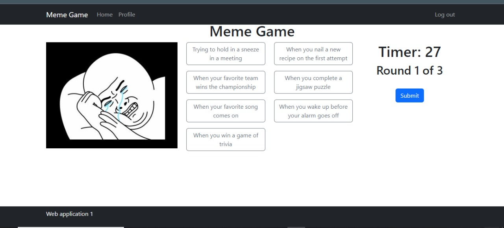
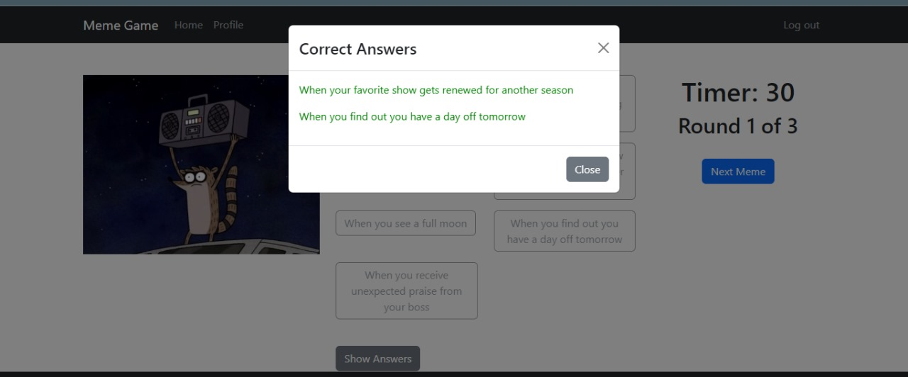

## React Client Application Routes

- Route `/` - Purpose: Displays the login page allowing users to log in with credentials or as a guest.
- Route `/home` - Purpose: Home page for logged-in users or guests, displaying user-specific information and game options.
- Route `/profile` - Purpose: Displays detailed user profile information, including game history and scores.
- Route `/game` - Purpose: Main game interface where users can play the meme game.
- Route `/*` - Purpose: Displays a 404 error page for any other routes.

## Main React Components

- `App` (in `App.jsx`): Purpose: Main component managing application routing and state.
- `GamePage` (in `GamePage.jsx`): Purpose: Renders the main game interface and handles game logic.
- `HomePage` (in `HomePage.jsx`): Purpose: Renders the home page interface with user-specific content.
- `Login` (in `Login.jsx`): Purpose: Renders the login form and handles user authentication.
- `ProfilePage` (in `UserProfile.jsx`): Purpose: Renders user profile information and game statistics.
- `LoadingSpinner` (in `LoadingSpinner.jsx`): Purpose: Renders loading spin in case of fetching.
- `Footer` (in `Footer.jsx`): Purpose: Renders footer at the bootom of a website.
- `CaptionList` (in `CaptionList.jsx`): Purpose: Renders Caption list, player click one of the possible correct answers.
- `Navigation` (in `Navigation.jsx`): Purpose: Render Navigation bar, with possible responsiveness.
- `NotFound` (in `NotFound.jsx`): Purpose: In any other given route render 404 error.
- `Timer` (in `Timer.jsx`): Purpose: Render Timer in Gamepage.

## API Server
- POST /api/login
  - Purpose: Handles user authentication.
  - Request Body: { username: string, password: string }
  - Response Body: { message: object }
  - Status Codes:
    - 200: Successful login.
    - 400: Invalid request format.
    - 401: Invalid credentials.

- GET /api/getid/:username
  - Purpose: By given username you get a id for this 
  - Parameters: username (string)
  - Response Body: { userId }, {message: error}
  - Status Codes: 
    - 200: Successful retrieval.
    - 500: Server error.
  
- POST /api/random-meme
  - Purpose: Retrieve random meme and 7 possible captions
  - Request Body: {usedMemeIds : number}
  - Response Body: { meme: object, captions: array }, {message: error}
  - Status Codes:
    - 200: Successful retrieval.
    - 500: Server error.
    - 404: No available memes

- POST /api/start-game
  - Purpose: Initiates a new game session for a user.
  - Request Body: { userId: number }
  - Response Body: {gameId: object}, {message: error}
  - Status Codes:
    - 200: Successful initiation.
    - 500: Server error.

- POST /api/save-round
  - Purpose: Saves round data including selected captions.
  - Request Body: { gameId: string, userId: string, memeId:     string, correctCaptionId: string, selectedCaptionId: string }
  - Response Body: {data : object}, {message: error}
  - Status Codes:
    - 200: Successful save.
    - 500: Server error.

- POST /api/savegame
  - Purpose: Save rounds and gameId.
  - Request Body: { userId, score, completed }
  - Response Body: {savedGame : object}, {message: error}
  - Status Codes:
    - 200: Successful save.
    - 500: Server error.

- GET /api/games/:userId
  - Purpose: Retrieves games associated with a specific user.
  - Parameters: { userId }
  - Response Body: Array of game objects, {message: error}
  - Status Codes:
    -  200: Successful retrieval.
    -  500: Server error.

- GET /api/rounds/:gameId
  - Purpose: Retrieves rounds for a specific game.
  - Parameters: { gameId }
  - Response Body: Array of round objects, {message: error}
  - Status Codes:
    - 200: Successful retrieval.
    - 500: Server error.

- GET /api/captions/:roundId
  - Purpose: For taking caption id and caption text of the round
  - Parameters: { roundId }
  - Response Body: Array of information of captions of given round, {message: error}
    - 200: Successful retrieval.
    - 500: Server error.

- GET /api/check-caption-correctness/:captionId/:memeId
  - Purpose: During the process of submitting the given caption, before we information of the memeId and captionId, so we call API, for checking it.
  - Parameters: { captionId, memeId }
  - Response Body: Boolean, either 1 or 0 and condition handled in the GamePage component, {message: error}
    - 200: Successful retrieval.
    - 500: Server error.

- GET /api/get-correct-captions/:memeId
  - Purpose: Get correct answers for using them later for showing the right answers
  - Parameters: { memeId }
  - Response Body: Array of correct answers for a given meme, {message: error}
    - 200: Successful retrieval.
    - 500: Server error.

## Database Tables

- Table `users` - has {id, username, password}. Using for authentication, create store and etc. of given user.
- Table `rounds` - has {id, game_id,meme_id, selected_caption_id,score, completed} from where gameid, meme_id and selected_caption_id are the foreign keys. For storing rounds of the games.
- Table `memes` - has {id and image_url (url of images that stored in public folder of client side)}. Each given id has unique meme which has a stored linked form where user can fetch and paste link.
- Table `meme_captions` has {meme_id, caption_id,is_best_match} from where meme_id and caption_id are foreign keys. Matrix format database, where each meme id and caption id are manipulated in order to know which on eis the best_match.
- Table `games` - has {id, user_id, total_score, completed} and has only one foreign key, user_id. For storing the games, and further for fetching information regarding rounds.
- Table `captions` - has {id, text}. FOr storing captions of memes, each meme has 2 captions.

## Screenshots

## Users Credentials

- username: murad, password: murad
- username: testuser, password: testpassword

## Notes
- nodemon should be installed globally, npm install -g nodemon
- for both (server and client), npm should be initialized 
